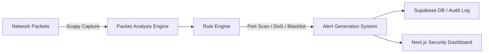

# 🛡️ SafeNet-IDS: Mini Intrusion Detection System

[](https://nextjs.org/)
[](https://react.dev/)
[](https://www.typescriptlang.org/)
[](https://tailwindcss.com/)
[](https://supabase.com/)
[](LICENSE)

**SafeNet-IDS** is a lightweight, cost-effective, real-time Intrusion Detection System (IDS) and cyber-threat monitoring dashboard. Designed to bridge the security gap for small organizations and individual users, SafeNet-IDS captures network traffic, analyzes packet headers, executes rule-based anomaly detection, and generates real-time security alerts.

---

## 🎯 Problem Statement

Traditional enterprise Intrusion Detection Systems (IDS) are often overly complex, resource-heavy, and cost-prohibitive for smaller teams or self-hosted environments. SafeNet-IDS addresses this challenge by providing an intuitive, open-source, and lightweight IDS solution capable of real-time traffic monitoring and rapid threat notification.

---

## ✨ Key Features

- 📡 **Real-Time Packet Capture & Inspection**: Monitors incoming network packets and extracts critical metadata including Source IP, Destination IP, Protocol, and Port numbers.
- ⚡ **Rule-Based Threat Detection Engine**: Automatically flags anomalous traffic patterns:
  - **Port Scanning Detection**: Detects rapid sequential or multi-port connection attempts from a single IP.
  - **Denial of Service (DoS) Alerts**: Identifies high-frequency packet bursts exceeding established rate thresholds.
  - **Blacklist & Threat Intelligence Matching**: Cross-references source IPs against known malicious IP watchlists.
- 📊 **Security Dashboard & Visualizations**: Interactive real-time metrics, live threat feeds, and packet volume charts powered by Recharts.
- 🔔 **Instant Alerting & Incident Logging**: Real-time notifications and centralized audit logging powered by Supabase.
- 🎨 **Modern Cyber-Security UI**: Built with Next.js 16 App Router, Radix UI primitives, Lucide icons, and Tailwind CSS dark theme.

---

## 🏗️ System Architecture



---

## 🛠️ Tech Stack

| Domain | Technology | Description |
|---|---|---|
| **Framework** | [Next.js 16](https://nextjs.org/) | App Router framework with React 19 |
| **Language** | [TypeScript 5.7](https://www.typescriptlang.org/) | Type-safe development |
| **Styling** | [Tailwind CSS 3.4](https://tailwindcss.com/) | Utility-first styling & dark mode |
| **UI Primitives** | [Radix UI](https://www.radix-ui.com/) | Accessible headless component primitives |
| **Data Visualization** | [Recharts](https://recharts.org/) | Responsive charting library for live metrics |
| **Database & Auth** | [Supabase](https://supabase.com/) | Open-source backend for logs & threat persistence |
| **Packet Engine** | Python / Scapy | Low-level network packet sniffing and parsing |

---

## 📁 Repository Structure

```text
SafeNet-IDS/
├── SafeNet IDS/             # Main Next.js Web Application & Dashboard
│   ├── app/                 # Next.js App Router pages & API routes
│   ├── components/          # Dashboard widgets, charts, and UI primitives
│   ├── hooks/               # Custom React hooks for live threat feeds
│   ├── lib/                 # Supabase client, threat rules, & utilities
│   ├── public/              # Static media assets & icons
│   ├── scripts/             # Threat simulation & packet capture helper scripts
│   ├── styles/              # Global CSS & Tailwind configuration
│   ├── components.json      # shadcn/ui component configuration
│   ├── next.config.mjs      # Next.js configuration
│   ├── package.json         # Project dependencies & scripts
│   └── tailwind.config.ts   # Tailwind CSS theme settings
└── README.md                # Project documentation
```

---

## 🔍 Rule Engine Logic

The core detection engine evaluates captured network traffic using key rule sets:

1. **Port Scanning Rule**:
   - *Condition*: `Count(Unique Destination Ports) > Threshold` within window `T`.
   - *Action*: Trigger **High Severity Alert** (Port Scan Attempt).

2. **DoS Rate Limit Rule**:
   - *Condition*: `Packets Received from IP > Threshold` within window `T`.
   - *Action*: Trigger **Critical Severity Alert** (Potential DoS / Flood Attack).

3. **Blacklist Matching Rule**:
   - *Condition*: `Source IP` matches `Threat Blacklist Database`.
   - *Action*: Trigger **Critical Severity Alert** (Known Malicious IP Activity).

---

## 🚀 Getting Started

### Prerequisites

- **Node.js**: `v18.0.0` or higher
- **pnpm / npm / yarn**: `pnpm` recommended
- **Python 3.x**: Required for Scapy packet sniffing scripts

### Installation & Setup

1. **Clone the repository:**
   ```bash
   git clone https://github.com/SiddhuKalvi/SafeNet-IDS.git
   cd SafeNet-IDS/"SafeNet IDS"
   ```

2. **Install dependencies:**
   ```bash
   pnpm install
   # or
   npm install
   ```

3. **Configure Environment Variables:**
   Create a `.env.local` file based on `.env.example`:
   ```env
   NEXT_PUBLIC_SUPABASE_URL=your_supabase_url
   NEXT_PUBLIC_SUPABASE_ANON_KEY=your_supabase_anon_key
   ```

4. **Run the Development Server:**
   ```bash
   npm run dev
   ```
   Open your browser and visit `http://localhost:3000`.

---

## 📄 License

Distributed under the **MIT License**. See `LICENSE` for more information.
